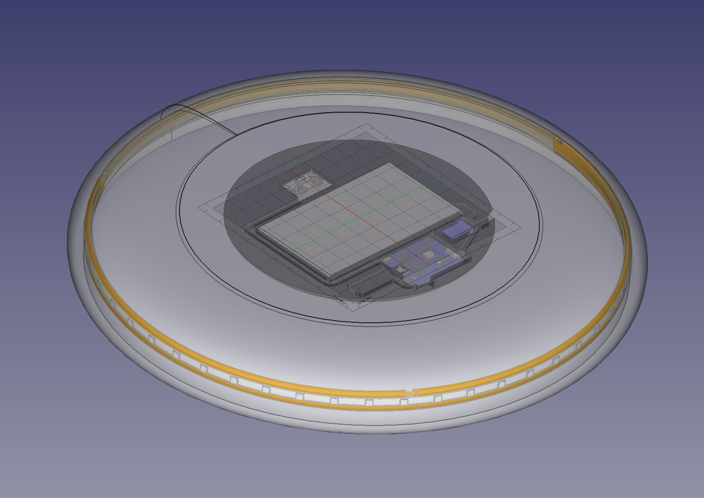
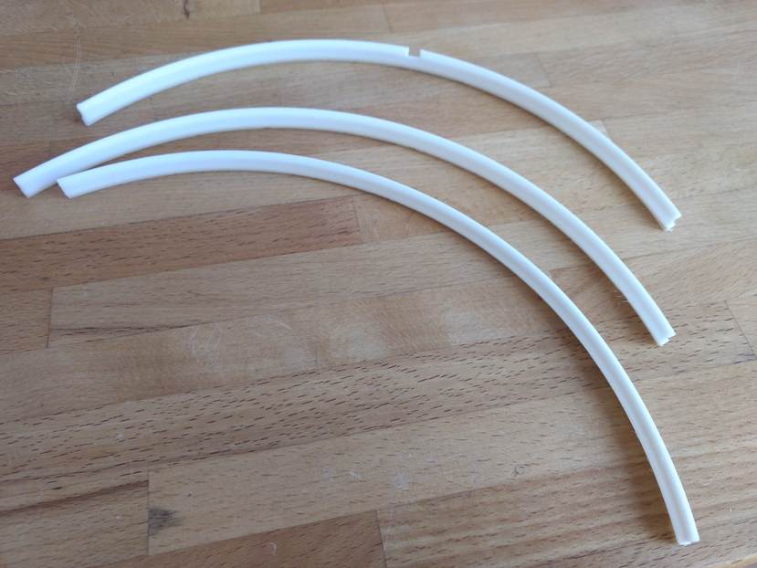
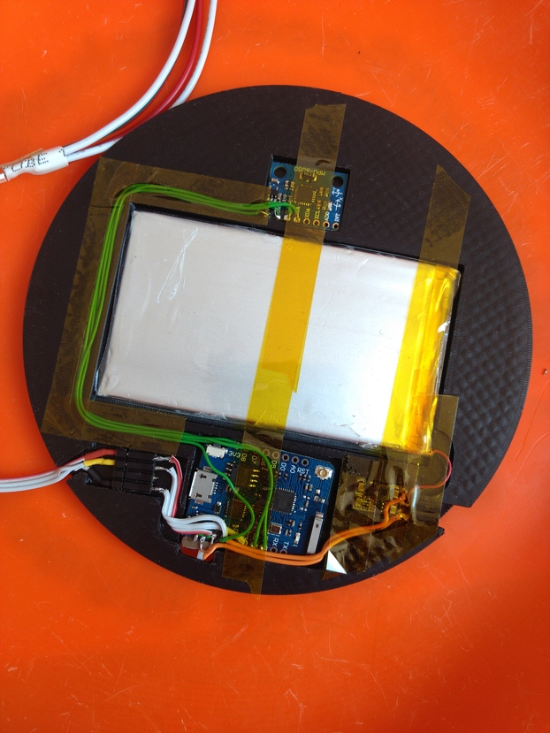
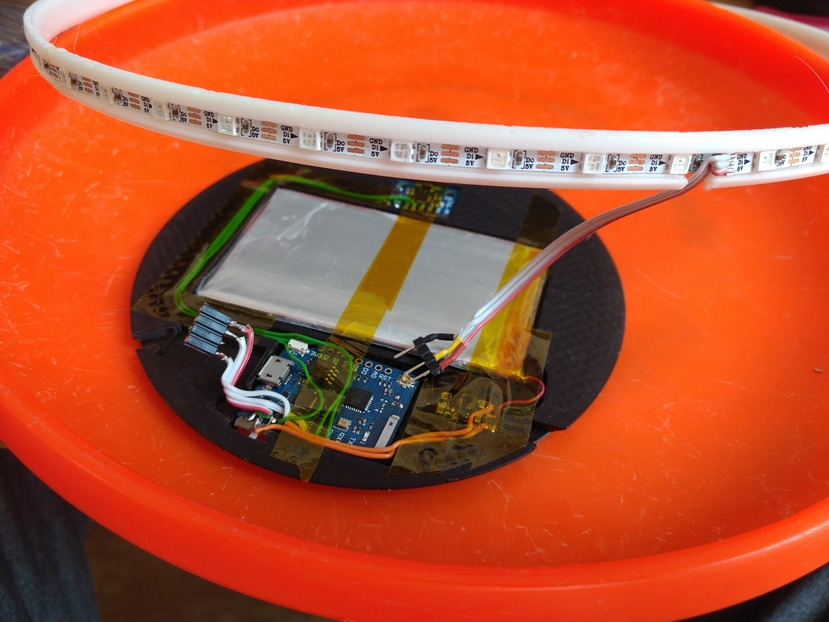

# WS2812 disc

Model for 3d-printed parts for a ws2812-lit Ultimate disc. Tested with DiscCraft * Euroddisc 175g.

Design in FreeCAD. Requires assembly4 workbench to function properly.

# Print recommendation

| Part   | Filament |
|:-------|---------:|
| Inner cover|  TPU | 
| Rim insert |  PLA | 

Rim can be printed in 3 sections on smaller printers and welded in situ with a soldering iron using a old tip on low temperature (ie ~100°C)

# Assembly

